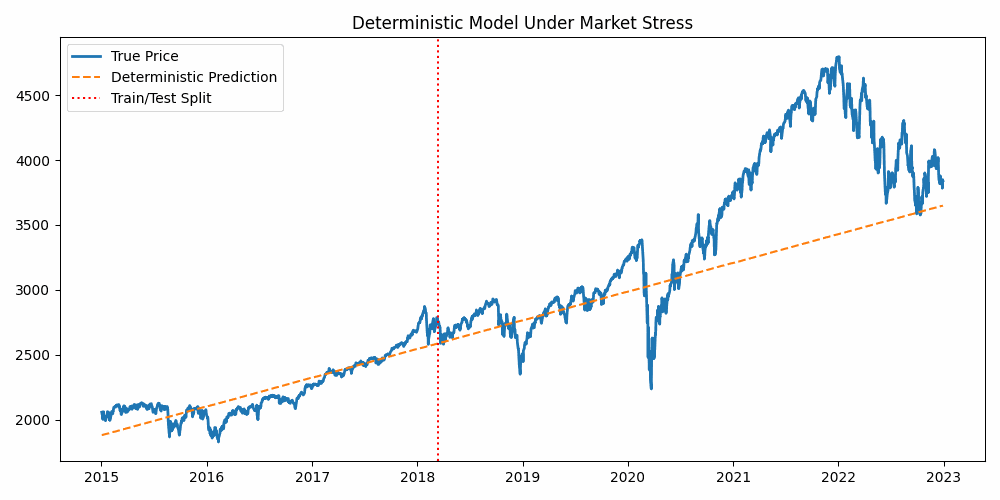

# Phase 1 — Deterministic Systems (Failure of Certainty)

## Purpose
This phase demonstrates why certainty-based forecasting models fail in real financial markets.

## Method
A simple deterministic linear trend model was trained on historical market prices and extrapolated forward without accounting for uncertainty, noise, or regime changes.

## Result
The model performs reasonably during stable market periods but diverges catastrophically during volatility spikes and market crashes.

## Visual Evidence
The GIF below shows how deterministic predictions collapse exactly when market risk is highest.

## Key Insight
Point predictions are fragile.
When uncertainty is ignored, models fail precisely when reliability matters most.

This motivates the transition to stochastic and uncertainty-aware modeling in Phase 2.
