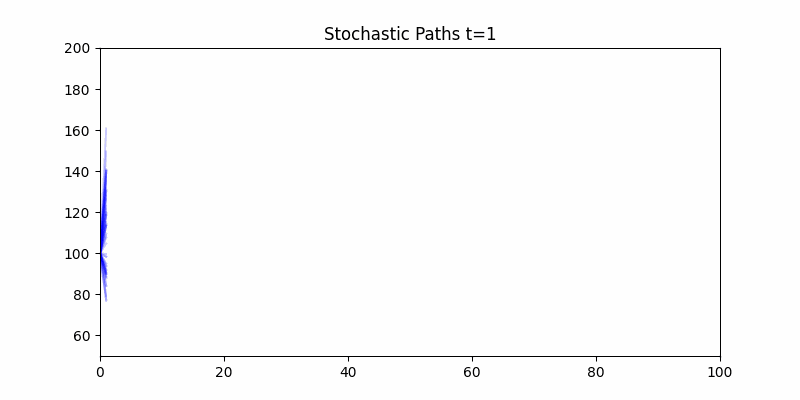

# Phase 2 — Stochastic Noise & Brownian Motion

## Purpose
Introduce uncertainty into market forecasting using stochastic differential equations (SDEs) and stochastic simulations.  
This phase highlights that **deterministic predictions fail under real-world volatility**.

## Method
- Simulate multiple market paths using **Geometric Brownian Motion (GBM)**.
- Generate a **cloud of stochastic paths** to visualize uncertainty.
- Incorporate randomness to mimic real market fluctuations.

## Visual Evidence

## Key Insight
- Markets are inherently uncertain.
- Modeling stochastic paths is the **first step toward robust forecasting**.
- Provides the foundation for **Phase 3**, where uncertainty evolves as **Markov regime transitions**.
